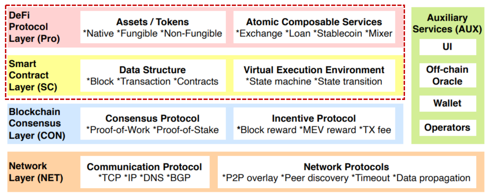

# Smart Contract Security 0x2 - 非重入攻击

## 合约安全资源

- [consensys.github.io/smart-contract-best-practices/](http://consensys.github.io/smart-contract-best-practices/)
- Smart Contract Security Field Guide: [https://scsfg.io/](https://scsfg.io/)
- BlockSec Academy: [https://github.com/blocksecteam/blocksec_academy](https://github.com/blocksecteam/blocksec_academy)
- DeFiHackLabs: [https://github.com/SunWeb3Sec/DeFiHackLabs](https://github.com/SunWeb3Sec/DeFiHackLabs)

## **High-level View of the Ecosystem**

[https://arxiv.org/abs/2208.13035](https://arxiv.org/abs/2208.13035)

## Pre-DeFi时代 vs. DeFi 时代

This course is focused on Non-reentrancy Issues.

**前DeFi时代**：非重入漏洞、重入漏洞

**后DeFi时代**：Dex（去中心化合约）、借贷（Lending）聚合器（Aggregator）、跨链桥（Brigde）

## **以太坊开发工具**：

ETH Dev Tool**s** [https://github.com/ConsenSys/ethereum-developer-tools-list](https://github.com/ConsenSys/ethereum-developer-tools-list)

常用的

框架：Hardhat、Foundry

IDE：Remix, Ethereum Studio, Visual Studio Code

链：Ethnode, Ganache, Infura, QuickNode, Moralis, Alchemy 

## 安全分析工具

### For PoC

- Simple PoC: Remix
- Complicated PoC: ~~Brownie + Ganache~~ Foundry + Phalcon Fork

### 代码分析

- Slither: [https://github.com/crytic/slither](https://github.com/crytic/slither)
- Mythril: [https://github.com/ConsenSys/mythril](https://github.com/ConsenSys/mythril)
- Dedaub: [https://library.dedaub.com/decompile](https://library.dedaub.com/decompile)
- [twitter.com/BlockSecTeam/status/1719231743515832549](http://twitter.com/BlockSecTeam/status/1719231743515832549/photo/1)

### 交易分析

- [https://github.com/SunWeb3Sec/DeFiHackLabs/tree/main/academy/onchain_debug/01_tools](https://github.com/SunWeb3Sec/DeFiHackLabs/tree/main/academy/onchain_debug/01_tools)
- Phalcon Explorer: [https://explorer.phalcon.xyz/](https://explorer.phalcon.xyz/) demo: [https://explorer.phalcon.xyz/tx/eth/0x2a027c8b915c3737942f512fc5d26fd15752d0332353b3059de771a35a606c2d](https://explorer.phalcon.xyz/tx/eth/0x2a027c8b915c3737942f512fc5d26fd15752d0332353b3059de771a35a606c2d)
- OpenChain, Tenderly

## 前DEFI时代的智能合约安全

## 一些典型的非重入漏洞

- Improper input validation 输入验证问题
    - Overflow/Underflow 上溢/下溢
    - Call injection 调用注入
- Flawed Access Control 访问控制问题

 溢出漏洞案例1：**batchOverflow (2018)**

利用 `uint256(cnt) * value` 上溢出

溢出漏洞案例2：SMT Token

溢出问题预防：

1.使⽤安全的库，⽐如：OpenZeppelin 的 SafeMath、SafeCast

2.使用新版本的编译器，sol@0.8版本后，自动进行检查（消耗Gas，如果使用unchecked进行gas优化后仍需注意溢出问题）

调用注入攻击案例：

调用方式：`addr.call(data)`  / `addr.call(selection, arg1, arg2, …)`

案例1:

案例2: ERC23利用合约Callback，绕过权限限制

如何预防？

- Including callee, arguments and return value 检查被调用合约、参数、返回值
- Need to be checked or verified
- Sometimes whitelist is helpful 白名单权限控制

**More Cases in Recent Years (2021-2023)**

Untrusted from/to addresses
Untrusted path
Untrusted xxx…

## Flawed Access Control 权限控制

**Case 1: Mismatched Constructor**

Fork出现漏洞，照抄构造函数，导致特权函数对外暴露

[https://etherscan.io/address/0xe82719202e5965Cf5D9B6673B7503a3b92DE20be#code](https://etherscan.io/address/0xe82719202e5965Cf5D9B6673B7503a3b92DE20be#code)

**Case 2: Public Ownership Transfer**

transferOwnership 没有访问控制

[https://bscscan.com/tx/0x0e14cb7eabeeb2a819c52f313c986a877c1fa19824e899d1b91875c11ba053b0](https://bscscan.com/tx/0x0e14cb7eabeeb2a819c52f313c986a877c1fa19824e899d1b91875c11ba053b0)

**Case 3: Recall call vs. delegatecall**

[https://medium.com/coinmonks/delegatecall-calling-another-contract-function-in-solidity-b579f804178c](https://medium.com/coinmonks/delegatecall-calling-another-contract-function-in-solidity-b579f804178c)

实际案例 **The Parity Multisig Wallet Hack**

delegatecall 利用 msg.data 调用未经保护的 initWallet

[https://etherscan.io/tx/0x9dbf0326a03a2a3719c27be4fa69aacc9857fd231a8d9dcaede4bb083def75ec](https://etherscan.io/tx/0x9dbf0326a03a2a3719c27be4fa69aacc9857fd231a8d9dcaede4bb083def75ec)

[https://medium.com/chain-cloud-company-blog/parity-multisig-hack-again-b46771eaa838](https://medium.com/chain-cloud-company-blog/parity-multisig-hack-again-b46771eaa838)

[https://medium.com/cybermiles/i-accidentally-killed-it-and-evaporated-300-million-6b975dc1f76b](https://medium.com/cybermiles/i-accidentally-killed-it-and-evaporated-300-million-6b975dc1f76b)

**Case 4: Contract or EOA?**

合约初始化过程中*extcodesize是0*

**OpenZeppelin中isContract的实现**

当`isContract()`为false时，不能通过isContract判断调用者是人类，看红框

**Subtle Details of the Flurry Finance Hack**

攻击者在EOA 和 contract 身份之间进行转换 ****

[https://mp.weixin.qq.com/s/spjhLaiAR_rTYm91jj3C8g](https://mp.weixin.qq.com/s/spjhLaiAR_rTYm91jj3C8g)

## Flawed Access Control **Mitigation 访问控制问题的防范措施**

- **Understand the design and code 理解设计和代码**
    - Be aware of the risks of exposing sensitive operations
    - Enforce the check when necessary 需要的时候强制检查
        - Use reliable libraries - Do NOT reinvent the wheel! 用可靠的库，不重复造轮子
        - Do NOT attempt to change them UNLESS there is some particular reason! 没事不要修改库
- **Some tools might be helpful 使用分析工具**
    - static analysis tools (with low false positives).